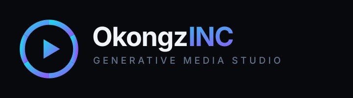

<div align="center">



**Self-hosted generative media studio — image, video, and 3D behind one pluggable provider layer.**

[](#verification)
[](LICENSE)
[](https://nodejs.org)

</div>

---

## What this is

A studio you run yourself. One UI, one API, and a provider layer that turns
different generation backends into interchangeable options. Works out of the box
with **zero API keys** because the default image provider (Pollinations) needs
none — then scales up as you add credentials.

| Modality | Provider | Credential | Status |
|---|---|---|---|
| Image | Pollinations (Flux / Turbo / Kontext) | none | works immediately |
| Image | Google Gemini Image | `GOOGLE_API_KEY` | opt-in |
| Image | Any OpenAI-compatible endpoint | `OPENAI_API_KEY` | opt-in |
| Video | Google Veo 3.1 (hosted API) | `GOOGLE_API_KEY` | opt-in |
| Video | [LongCat-Video](https://github.com/meituan-longcat/LongCat-Video) 13.6B on Modal | `MODAL_LONGCAT_URL` | opt-in, needs deploy |
| 3D | [microsoft/TRELLIS.2](https://github.com/microsoft/TRELLIS.2) on Modal | `MODAL_TRELLIS_URL` | opt-in, needs deploy |
| Research | Reach — URL → markdown ([Agent Reach](https://github.com/Panniantong/Agent-Reach) / Jina Reader) | none | works immediately |

A provider whose credential is missing is not hidden — it appears in the UI
disabled, with the exact reason ("`GOOGLE_API_KEY` is not set"). No silent
fallbacks, no guessing why an option does nothing.

## Quick start

```bash
git clone https://github.com/jokoprianto612-lang/okongzinc-studio.git
cd okongzinc-studio

npm run setup          # installs server/ and web/ separately
cp .env.example .env   # optional: every provider is opt-in

npm run dev            # server :8787 + web :5173
```

Open <http://localhost:5173>, type a prompt, press **Generate**. That path needs
no keys at all — and so does **Reach**, the reference-research panel below the
form.

For a single-process deployment:

```bash
npm run build          # builds server/dist and web/dist
npm start              # Express serves the API and the built SPA on :8787
```

> **Security note.** `API_KEY` in `.env` is empty by default, which leaves the
> API **unauthenticated** — correct for localhost, wrong for anything reachable
> by others. The server prints a warning on every boot while it is blank. Set it
> before binding to a public interface; the UI has a field to store the matching
> key.

## How generation flows

```
browser ──POST /api/generate──▶ validation (zod) ──▶ job queue (in-memory)
                                                          │
                                              provider.generate()
                                                          │
                                            artifact written to storage/
                                                          │
browser ◀──GET /api/jobs/:id (poll every 2s)◀─────────────┘
```

Jobs are queued rather than run inline because generation takes seconds to
minutes and providers rate-limit. The client polls instead of holding a socket,
so a reload or a sleeping laptop never loses a running job.

## Enabling the other providers

### Google (image + video)

Get a key at [aistudio.google.com/apikey](https://aistudio.google.com/apikey) and
put it in `.env`:

```env
GOOGLE_API_KEY=your-key
```

Restart the server. Both **Google Gemini Image** and **Google Veo** become
selectable.

Free-tier media quota is small. Once spent the API returns `429
RESOURCE_EXHAUSTED`, and the studio surfaces that verbatim: *"Google API quota
exhausted for this key."* That is a billing state, not a bug in the app.

### Video via LongCat-Video (open weights)

Two very different video paths ship side by side:

|  | Google Veo 3.1 | LongCat-Video |
|---|---|---|
| Kind | hosted API | self-hosted open weights (13.6B) |
| Cost model | per-request quota | GPU-seconds on Modal |
| Setup | paste an API key | deploy a worker, download ~83 GB |
| Tasks | text→video, image→video | text→video, image→video, **native continuation** |
| Output | provider default | 480p/15fps, optional 720p/30fps refine |

LongCat's distinguishing feature is that it was **pretrained on video
continuation**, so it extends a clip without the colour drift that frame-chaining
produces. Deploy it:

```bash
pip install modal
modal setup

modal run modal/longcat_app.py::download_weights   # ~83 GB, once
modal deploy modal/longcat_app.py
```

Paste the printed endpoint into `.env`:

```env
MODAL_LONGCAT_URL=https://<workspace>--okongzinc-longcat-generate.modal.run
```

The **Video** tab then exposes five modes: 480p base (50 steps, best quality),
480p distilled (16 steps, fast), 720p refined (slowest), image→video, and
continuation.

> An H100 is billed per second and a refined 720p clip takes minutes. The worker
> keeps the container warm for 10 minutes so consecutive runs skip the cold
> start, then shuts down.

### Reach — grounding a prompt in a real page

Generative models describe things from memory. When you want a prompt anchored to
something real — an actual product listing, a specific tweet, a paper's abstract
— **Reach** pulls the page down as clean markdown so you can build the prompt
from source text.

Two backends, tried in order:

1. **[agent-reach](https://github.com/Panniantong/Agent-Reach) CLI** when on
   PATH — covers Twitter/X, Reddit, YouTube subtitles, Bilibili, XiaoHongShu,
   GitHub, and RSS, each behind a primary + fallback backend list.
2. **Jina Reader** (`r.jina.ai`) — no install, no key, any public URL.

Backend 2 always works, so Reach needs zero configuration. To unlock the
platforms a plain fetch cannot reach:

```bash
pip install https://github.com/Panniantong/agent-reach/archive/main.zip
agent-reach install --env=auto
```

`/api/health` reports which backend is live, and the panel shows it in the UI.

> **Fetched pages are untrusted text.** Reach shows the content read-only for you
> to read and edit; it is never executed and never auto-injected into a prompt.
> "Append to prompt" is an explicit click. The endpoint also refuses private,
> loopback, and link-local addresses, so it cannot be used to probe your LAN.

### 3D via TRELLIS.2

TRELLIS.2 needs an **NVIDIA GPU with ≥24 GB VRAM** (upstream verified it on
A100/H100 with CUDA 12.4). It cannot run on a normal laptop, so the studio calls
a Modal endpoint:

```bash
pip install modal
modal setup
modal deploy modal/trellis_app.py
```

Copy the printed URL into `.env`:

```env
MODAL_TRELLIS_URL=https://<workspace>--okongzinc-trellis-generate.modal.run
```

The **3D** tab then accepts an image and returns a `.glb`. Generate an image
first, click **Use as source**, and it flows straight in.

## Adding your own provider

One file, one array entry. Implement the `Provider` interface:

```ts
// server/src/providers/myProvider.ts
export const myProvider: Provider = {
  id: 'my-provider',
  label: 'My Provider',
  modality: 'image',
  requiresSourceImage: false,
  supportsSeed: true,
  supportsNegativePrompt: false,
  supportedAspectRatios: ['1:1', '16:9'],
  models: [{ id: 'default', label: 'Default' }],

  availability() {
    return process.env.MY_KEY
      ? { available: true }
      : { available: false, reason: 'MY_KEY is not set' };
  },

  async generate(req, ctx) {
    ctx.onProgress('calling my provider');
    const bytes = await callMyApi(req.prompt);
    return [await saveArtifact(bytes, 'image/png')];
  },
};
```

Append it to `ALL_PROVIDERS` in `server/src/providers/index.ts`. The UI picks up
its capabilities automatically — the form renders a seed input only if
`supportsSeed` is true, and so on. Nothing else changes.

## API

| Method | Path | Purpose |
|---|---|---|
| `GET` | `/api/health` | liveness, queue depth, whether auth is on |
| `GET` | `/api/providers` | capability descriptors + per-modality defaults |
| `POST` | `/api/generate` | enqueue a job → `202` with the job |
| `GET` | `/api/jobs` | recent jobs, newest first |
| `GET` | `/api/jobs/:id` | one job — poll this for progress |
| `POST` | `/api/jobs/:id/cancel` | abort a queued or running job |
| `POST` | `/api/reach` | fetch a reference URL as markdown |
| `POST` | `/api/upload` | store a data URL → `/media/...` path |
| `GET` | `/media/*` | generated files, read-only |

```bash
curl -X POST http://localhost:8787/api/generate \
  -H 'Content-Type: application/json' \
  -d '{"modality":"image","provider":"pollinations","prompt":"a neon aperture logo","aspectRatio":"16:9"}'
```

## Layout

```
okongzinc-studio/
├── server/                  Express + TypeScript API
│   └── src/
│       ├── index.ts         routes, CORS, static hosting, shutdown
│       ├── config.ts        validated env, per-provider blocks
│       ├── jobQueue.ts      in-memory queue with concurrency + cancel
│       ├── storage.ts       artifact persistence, path-traversal guard
│       ├── validation.ts    zod schemas
│       ├── reach.ts         URL → markdown, agent-reach → Jina fallback
│       └── providers/       one file per backend
├── web/                     Vite + React + TypeScript + Tailwind
│   └── src/
│       ├── App.tsx          tabs, active job, gallery
│       ├── components/      form, gallery, viewer, primitives
│       ├── hooks/           job polling
│       └── lib/             API client, wire types
├── modal/
│   ├── trellis_app.py       TRELLIS.2 image→3D worker (A100)
│   └── longcat_app.py       LongCat-Video worker (H100, ~83 GB weights)
└── docs/ARCHITECTURE.md     design decisions and tradeoffs
```

## Verification

Both packages typecheck and build clean, and the image path was exercised
end-to-end rather than assumed:

```
server  tsc -p tsconfig.json                     ✓
web     tsc -b && vite build                     ✓  162 kB js / 16 kB css
POST /api/generate → 202, succeeded in 3.5s      ✓  46 KB jpeg, artifact on disk
GET  /media/<file>                               ✓  200 image/jpeg
POST /api/reach (LongCat repo)                   ✓  24,213 chars in 0.6s
POST /api/reach (Agent-Reach docs)               ✓  21,878 chars
browser: prompt → Generate → SUCCEEDED + image   ✓
browser: Reach → Fetch → Append to prompt        ✓  1,500 chars into the form
```

Rejected as expected:

```
/media/../../.env                    404
localhost / 127.0.0.1 / 192.168.x    400  private address refused
169.254.169.254 (cloud metadata)     400  link-local refused
file:// and ftp://                   400  only http(s) supported
unknown provider                     400
empty prompt                         400  with the offending field
video provider asked for an image    400  "produces video, not image"
LongCat with no MODAL_LONGCAT_URL    503  with the deploy instruction
```

## Known limits

- **Job history is in memory.** Restarting the server clears the list; the files
  themselves stay in `storage/`. Swap `jobQueue.ts` for a SQLite store if
  history needs to survive restarts.
- **3D output has no in-app viewer.** A `.glb` is offered as a download rather
  than pulling three.js in for one feature. Open it in Blender or Windows 3D
  Viewer.
- **No npm workspaces.** npm symlinks workspace packages, which fails with
  `EPERM` on Windows without Developer Mode. Each package installs on its own
  and `npm run setup` drives both.
- **Provider latency is uneven.** Pollinations queue depth swings between ~3s
  and ~45s for the same prompt. The progress bar is indeterminate on purpose:
  no provider reports a real percentage, and inventing one would be a lie.
- **The Modal workers are written but not deployed here.** Their Python compiles
  and the request/response contract matches the providers, but neither TRELLIS.2
  nor LongCat has been run end-to-end — that needs a Modal account with GPU
  quota and, for LongCat, an ~83 GB download. Expect to debug the first deploy.
- **LongCat-Video is slow and not cheap.** A 480p clip is minutes on an H100;
  720p refinement is slower. It buys you no quota ceiling and no content gate you
  do not control, not speed.

## License

MIT — see [LICENSE](LICENSE).
